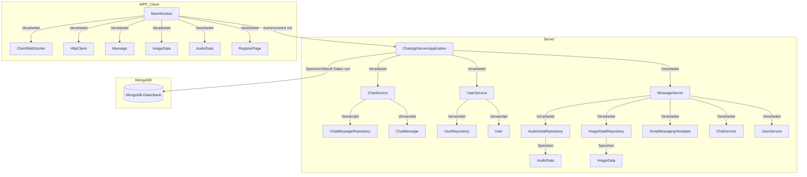
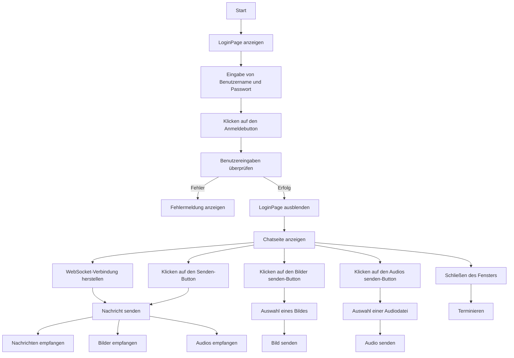
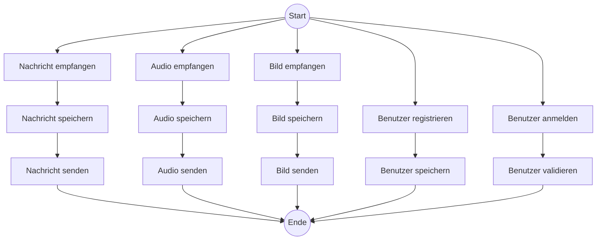
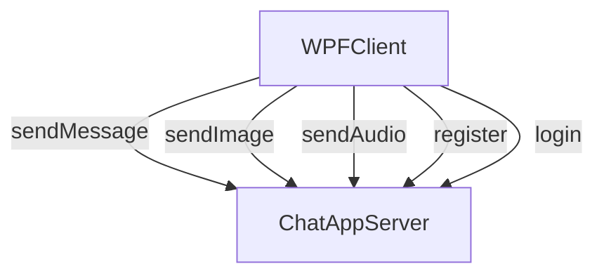
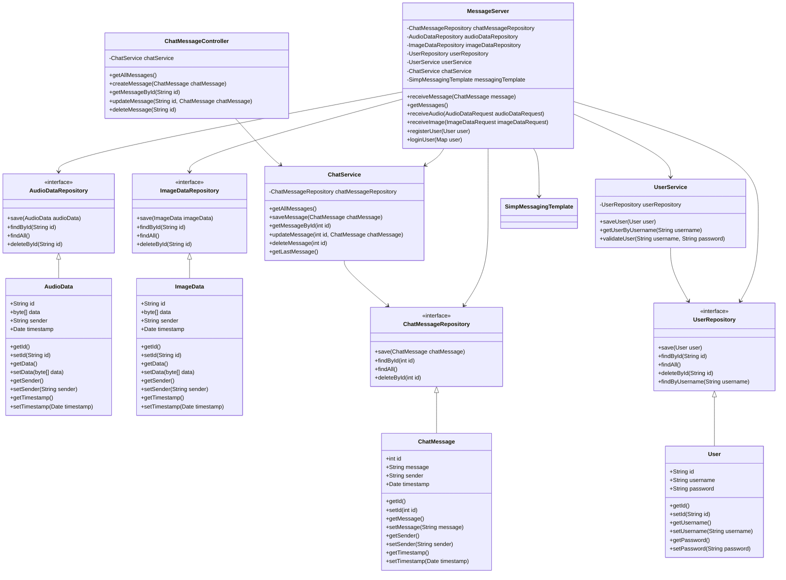
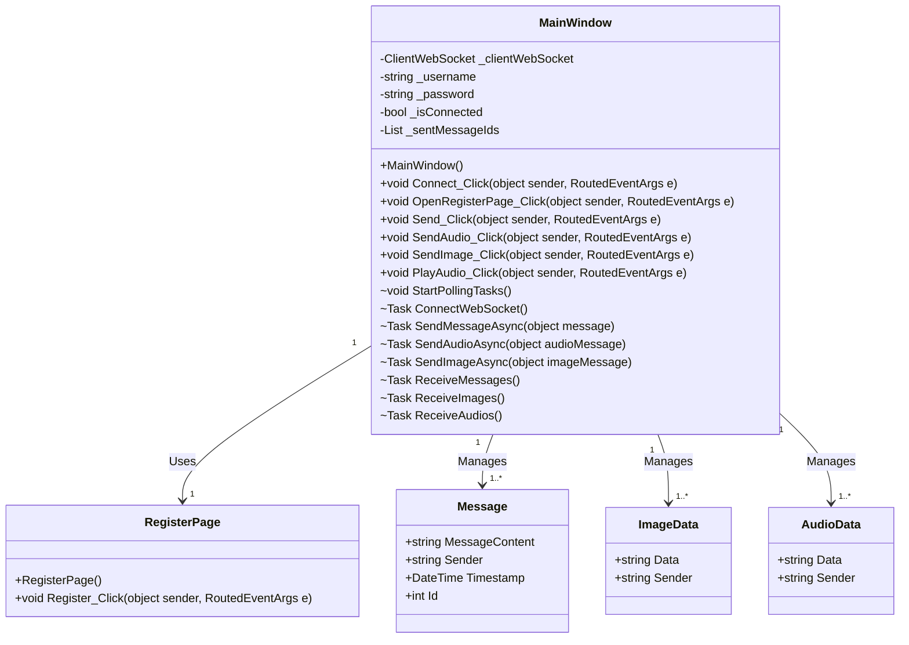

# ChatApp

## Inhaltsverzeichnis
1. [Softwaredesign (Architektur)](#softwaredesign-architektur)
2. [Beschreibung der Software](#beschreibung-der-software)
3. [API-Beschreibung](#api-beschreibung)
4. [Verwendung der API](#verwendung-der-api)
5. [Diagramme](#diagramme)
6. [Diskussion der Ergebnisse](#diskussion-der-ergebnisse)

## Softwar-Architektur
Die ChatApp basiert auf einem Spring Boot-Server mit einer MongoDB-Datenbank zur Speicherung von Nachrichten, Benutzern und Mediendaten (Images, Audios). Die Anwendung verwendet RESTful APIs für die Kommunikation und ermöglicht WebSocket-Verbindungen für Echtzeit-Messaging. Der Client ist eine WPF-Anwendung, welche die Benutzeroberfläche für die Interaktion mit dem Server bereitstellt.



## Beschreibung der Software
Diese ChatApp Anwendung ermöglicht Benutzern Nachrichten in Echtzeit zu senden und zu empfangen. Die Hauptfunktionen umfassen das Senden von Textnachrichten, Bildern und Audiodateien sowie die Benutzerregistrierung und -anmeldung. Die Anwendung unterstützt Echtzeit-Kommunikation über WebSockets und speichert alle Nachrichten und Mediendaten in einer MongoDB-Datenbank. Ich habe mir vorgenommen, dass man auch Audios und Images empfangen kann nur konnte ich die entsprechenden Funktionen noch nicht fertig stellen aber das senden dieser Nachrichten Typen an den Server und die Speicherung in der MongoDB funktioniert.

Der WPF-Client bietet eine benutzerfreundliche Oberfläche für die Interaktion mit dem Server, einschließlich der Anzeige von Nachrichten, dem Senden von Textnachrichten, Bildern und Audiodateien sowie der Benutzerverwaltung. Wenn man den Client startet sieht man zuerst das Login Fenster mit der möglichkeit sich einzuloggen oder den Button für die Registrierung anzuklicken, erst wenn man sich angemeldet hat gelangt man in den eigentlichen Chat wo man die schon vorher genannten funktionen verwenden kann.

## API-Beschreibung
### Nachrichten
* **GET /api/messages**: Abrufen aller Nachrichten (alle "/api/..." wurden durch POSTMAN getestet)
* **POST /api/messages**: Erstellen einer neuen Nachricht
* **GET /api/messages/{id}**: Abrufen einer Nachricht nach ID
* **PUT /api/messages/{id}**: Aktualisieren einer Nachricht nach ID
* **DELETE /api/messages/{id}**: Löschen einer Nachricht nach ID
* **POST /sendMessage**: Senden einer Nachricht über WebSocket
* **GET /topic/messages**: Abrufen der letzten Nachricht über das Websocket Thema

### Bilder
* **POST /sendImage**: Senden eines Bildes

### Audio
* **POST /sendAudio**: Senden einer Audiodatei

### Benutzer
* **POST /register**: Benutzerregistrierung
* **POST /login**: Benutzeranmeldung

## Verwendung der API
### Nachrichten abrufen
```java
@GetMapping
    public List<ChatMessage> getAllMessages() {
        return chatService.getAllMessages();
    }
```
### Nachricht erstellen
```java
@PostMapping
    public ChatMessage createMessage(@RequestBody ChatMessage chatMessage) {
        return chatService.saveMessage(chatMessage);
    }
```
### Nachricht nach ID abrufen
```java
@GetMapping("/{id}")
    public Optional<ChatMessage> getMessageById(@PathVariable String id) {
        return chatService.getMessageById(Integer.parseInt(id));
    }
```
### Nachricht aktualisieren
```java
@PutMapping("/{id}")
    public ChatMessage updateMessage(@PathVariable String id, @RequestBody ChatMessage chatMessage) {
        return chatService.updateMessage(Integer.parseInt(id), chatMessage);
    }
```
### Nachricht löschen
```java
@DeleteMapping("/{id}")
    public boolean deleteMessage(@PathVariable String id) {
        return chatService.deleteMessage(Integer.parseInt(id));
    }
```
### Nachricht über WebSocket senden
```java
@PostMapping("/sendMessage")
    @SendTo("/topic/messages")
    public ResponseEntity<String> receiveMessage(@RequestBody ChatMessage message) {
        try {
            // Debugging logs
            System.out.println("Received message content: " + message.getMessage());
            System.out.println("Sender: " + message.getSender());
            // Set the new ID for the message
            ChatMessage lastMessage = chatService.getLastMessage();
            if (lastMessage != null) {
                message.setId(lastMessage.getId() + 1);
            } else {
                message.setId(1);
            }

            message.setTimestamp(new Date()); 


            chatService.saveMessage(message);
            messagingTemplate.convertAndSend("/topic/messages", message);
            return ResponseEntity.ok("Message received successfully!");
        } catch (Exception e) {
            return ResponseEntity.status(HttpStatus.INTERNAL_SERVER_ERROR).body("Failed to send message: " + e.getMessage());
        }
    }
```
### Abrufen der letzten Nachricht über WebSocket-Thema
```java
@GetMapping("/topic/messages")
    public ResponseEntity<ChatMessage> getMessages() {
        try {
            ChatMessage message = chatService.getLastMessage();
            return ResponseEntity.ok(message);
        } catch (Exception e) {
            return ResponseEntity.status(HttpStatus.INTERNAL_SERVER_ERROR).body(null);
        }
    }
```

## Kommunikation des WPF-Client mit dem Server
### Beispielcode zum Senden einer Nachricht (C#)
```csharp
private async void Send_Click(object sender, RoutedEventArgs e)
{
    string messageContent = MessageInput.Text.Trim();

    if (!string.IsNullOrEmpty(messageContent))
    {
        var chatMessage = new { message = messageContent, sender = _username };
        var json = JsonSerializer.Serialize(chatMessage);
        var content = new StringContent(json, Encoding.UTF8, "application/json");
        var message = new { content = MessageInput.Text, sender = _username };


        using (var client = new HttpClient())
        {
            try
            {
                var response = await client.PostAsync("http://localhost:8080/sendMessage", content);
                var responseMessage = await response.Content.ReadAsStringAsync();
                await SendMessageAsync(responseMessage);
                MessageInput.Text = string.Empty;
            }
            catch (Exception ex)
            {
                //MessageArea.Items.Add($"Failed to send message: {ex.Message}");
            }
        }
    }
}
 private async Task SendMessageAsync(object message)
 {
     if (!_isConnected)
     {
         return;
     }

     var json = JsonSerializer.Serialize(message);
     var buffer = Encoding.UTF8.GetBytes(json);

     await _clientWebSocket.SendAsync(new ArraySegment<byte>(buffer), WebSocketMessageType.Text, true, CancellationToken.None);
 }
```

### Beispielcode zum Empfangen von Nachrichten (C#)
```csharp
private async Task ConnectWebSocketAsync()
{
    using (var client = new ClientWebSocket())
    {
        await client.ConnectAsync(new Uri("ws://localhost:8080/topic/messages"), CancellationToken.None);
        
        var buffer = new byte[1024 * 4];
        WebSocketReceiveResult result = await client.ReceiveAsync(new ArraySegment<byte>(buffer), CancellationToken.None);
        
        while (result.MessageType != WebSocketMessageType.Close)
        {
            var message = Encoding.UTF8.GetString(buffer, 0, result.Count);
            // Process the message
            result = await client.ReceiveAsync(new ArraySegment<byte>(buffer), CancellationToken.None);
        }
    }
}
private async Task ReceiveMessages()
{
    using (var client = new HttpClient())
    {
        while (true)
        {
            try
            {
                var response = await client.GetAsync("http://localhost:8080/topic/messages");
                if (response.IsSuccessStatusCode)
                {
                    var json = await response.Content.ReadAsStringAsync();
                    Console.WriteLine($"Received JSON: {json}");

                    var message = JsonSerializer.Deserialize<Message>(json, new JsonSerializerOptions { PropertyNameCaseInsensitive = true });

                    if (message != null && !_sentMessageIds.Contains(message.Id))
                    {
                        _sentMessageIds.Add(message.Id);

                        Console.WriteLine($"Deserialized message: {message.Sender}, {message.MessageContent}");

                        Dispatcher.Invoke(() =>
                        {
                            Console.WriteLine($"Processing message from {message.Sender}: {message.MessageContent}");

                            var textBlock = new TextBlock
                            {
                                Text = $"{message.Sender}: {message.MessageContent}",
                                Margin = new Thickness(5)
                            };
                            MessagesPanel.Children.Add(textBlock);
                        });
                    }
                    else
                    {
                        Console.WriteLine("Message has already been sent");
                    }
                }
                else
                {
                    var error = await response.Content.ReadAsStringAsync();
                    Console.WriteLine($"Error response: {error}");
                }
            }
            catch (Exception ex)
            {
                Console.WriteLine($"Error receiving messages: {ex.Message}");
            }

            await Task.Delay(3000);// test
        }
    }
}
```

## Diagramme
### Aktivitätsdiagramm WPF-Client

### Aktivitätsdiagramm Server

### Use-Case-Diagramm


### Klassen-Diagramm Server

### Klassen-Diagramm WPF-Client

## Diskussion der Ergebnisse
### Zusammenfassung
Der ChatAppServer bietet eine robuste Plattform für Echtzeit-Kommunikation durch die Verwendung von Spring Boot und MongoDB. Die Integration von WebSockets ermöglicht eine schnelle und effiziente Nachrichtenübertragung, während die RESTful APIs eine einfache Interaktion mit dem Backend gewährleisten. Der WPF-Client bietet eine benutzerfreundliche Oberfläche für die Interaktion mit dem Server.


### Zukunfts-Ausblick
Zukünftige Arbeiten könnten die Fertigstellung der im Projekt-Antrag gesetzten Anforderungen beinhalten, darunter die Erstellung des WEB Clients und die Fertigstellung der Empfangsfunktionen für Images und Audios.
